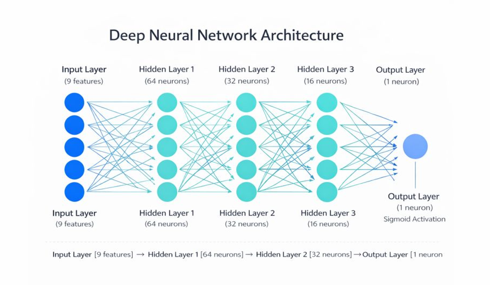

# Neural Network from Scratch (NumPy)

## Overview
This project implements a fully connected deep neural network **from scratch**
using only NumPy, without relying on deep learning frameworks.

The goal is to understand and demonstrate the **mathematical intuition**
behind forward propagation, backpropagation, and gradient-based learning.

---

## Model Architecture
Input → 64 → 32 → 16 → Output (Binary)

- Input layer : medical features
- Hidden layers : ReLU activation
- Output layer : Sigmoid activation
- Loss : Binary Cross Entropy



---

## 🧠 Mathematical Intuition Behind the Network

### 1️⃣ Forward Propagation: From Inputs to Prediction
A neural network does not “think” — it performs repeated linear and non-linear transformations.

For each layer, the computation is:

         Z(l) = A(l-1)* W(l)+ b(l)
         A(l) = g(Z(l))

Where:
- A( l-1 ) is the activation from the previous layer
- W( l ) and b( l ) are learnable parameters
- g( . ) is a non-linear activation fxn 

In this model:
- ReLU is used in hidden layers to introduce non-linearity
- Sigmoid is used in the output layer to produce a probability between 0 and 1

Architecture :
```css
Input -> 64 -> 32 -> 16 -> Output 
```
---
### 2️⃣ Why Non-Linearity (ReLU) Is Essential
If all layers were linear, the entire network would collapse into a single linear transformation, regardless of depth.

ReLU introduces a piecewise non-linearity:

              ReLU(Z)= max(0,Z)

**This allows the network to:**
- Learn complex decision boundaries
- Model interactions between features
- Avoid vanishing gradients during training

Depth + non-linearity is what gives neural networks their expressive power.

---
### 3️⃣ Output Layer and Probability Interpretation
The final layer uses the Sigmoid function:
       
          σ(z)=  __1___
                 1+e−z1​

This maps any real number to a probability in [0,1].

**Interpretation:**
- Output ≈ 0 → benign
- Output ≈ 1 → malignant

The network is therefore learning a probabilistic decision boundary, not a hard rule.

---
### 4️⃣ Loss Function: Measuring Error
Learning requires a quantitative measure of “how wrong” the prediction is.

For binary classification, Binary Cross Entropy (BCE) is used:

     L(y , yo) = - [y*log(yo) + (1-y)*log(1- yo) ]

**Key Intuition:**
- Confident wrong predictions are penalized heavily
- Correct predictions with high confidence are rewarded
- The loss surface is smooth, enabling gradient-based optimization

---

### 5️⃣ Backpropagation: Learning via the Chain Rule
Backpropagation is not a special algorithm — it is simply the chain rule from calculus applied repeatedly.

The goal is to compute:

           ∂L/∂W(l)  and  ∂L/∂b(l)

Starting from the output layer and moving backward:

- Compute error at the output
- Propagate the error through each layer
- Scale gradients based on activation derivatives
- Accumulate gradients for weights and biases

**Each layer answers the question:**

    "How much did I contribute to the final error?"

---
### 6️⃣ Gradient Descent: Parameter Updates
Once gradients are computed, parameters are updated using **gradient descent**:

        W -= W -( α * ∂L/∂W )
        b -= b -( α * ∂L/∂b )

**Where:**
- 𝛼 is the learning rate
- The update moves parameters in the direction of steepest loss reduction

This process is repeated over many epochs, gradually shaping the network into a useful decision function.

---
### 7️⃣ Handling Real-World Data Behavior

During training, the model exhibited behavior typical of imbalanced datasets, where predicting the majority class yields deceptively high accuracy.

This highlights an important real-world lesson:

- Model correctness ≠ model usefulness
- Loss behavior and prediction distributions matter more than accuracy alone

**Understanding this behavior is as important as implementing the math itself.**

---
### 8️⃣ Key Takeaway
A neural network is not magic.

It is:
- Linear algebra (matrix multiplications)
- Non-linear functions
- Calculus (gradients and chain rule)
- Optimization (gradient descent)

This project exposes these components explicitly, demonstrating how deep learning frameworks are built from first principles.

---

## Training
- Optimizer: Gradient Descent
- Learning Rate: configurable
- Dataset: Breast Cancer Wisconsin (cleaned)

---

## Future Work

- Mini-batch training
- Regularization
- Visualization
- Extension to multi-class classification

## Author
KARTHIK RAJ PANUGANTI

- GITHUB : https://github.com/KARTHIK1749

- LINKEDIN :https://www.linkedin.com/in/karthik-panuganti666 

**NOTE :** This is made for the deep understanding of mathematical intuition of Neural Network And Building it from scratch.